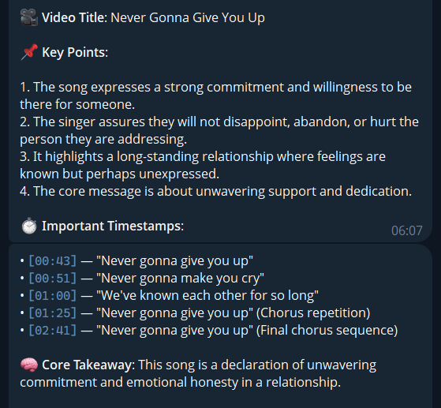
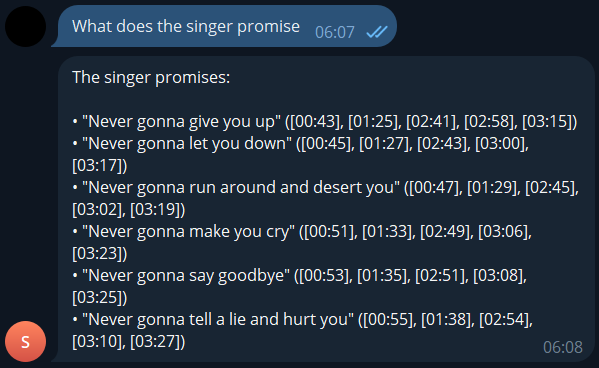
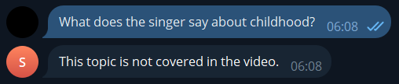
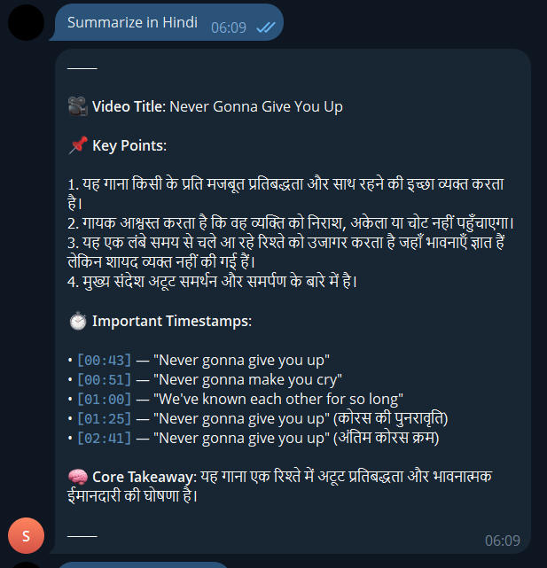
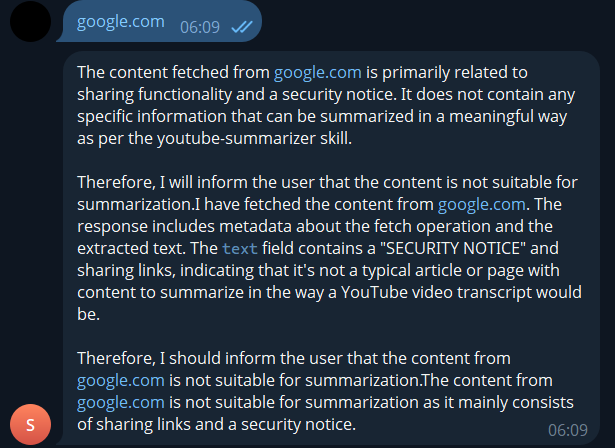

# YouTube Summarizer & Q&A Bot

A Telegram bot skill for [OpenClaw](https://openclaw.ai) that summarizes YouTube videos and answers follow-up questions about them. Built as an internship assignment.

## Features

- **Structured Summaries** — 🎥 Title, 📌 5 Key Points, ⏱ Timestamps, 🧠 Core Takeaway
- **Follow-up Q&A** — Ask questions grounded in the transcript (no hallucinations)
- **Multi-language** — Responds in Hindi, Tamil, Kannada, and other Indian languages on request
- **Caching** — Transcripts cached locally for 7 days to avoid redundant API calls
- **Error Handling** — Friendly messages for invalid URLs, missing captions, private videos, rate limits
- **Bonus Commands** — `/summary`, `/deepdive`, `/actionpoints`, `/lang`

## Screenshots

### Video Summary


### Follow-up Q&A


### Not Covered in Video


### Hindi Summary


### Error Handling


## Architecture

```
User (Telegram)
    │
    ▼
OpenClaw Gateway ──▶ Reads SKILL.md instructions
    │
    ▼
Gemini 2.5 Flash (LLM) detects YouTube URL
    │
    ▼
Runs: python index.py "<video_url>"
    │
    ├── extract_video_id.py  →  Parses URL into video ID
    ├── youtube-transcript-api →  Fetches transcript from YouTube
    ├── format_transcript.py →  Formats into timestamped text
    ├── chunk_transcript.py  →  Splits long videos into chunks
    └── cache/               →  Saves transcript JSON locally
    │
    ▼
Transcript text returned to stdout
    │
    ▼
Gemini reads transcript → Generates summary → Sends to Telegram
    │
    ▼
Session memory retains transcript context for Q&A follow-ups
```

### How It Works

1. **Trigger**: User sends a YouTube link on Telegram
2. **Skill Activation**: OpenClaw matches the URL against the youtube-summarizer skill description
3. **Transcript Fetch**: The LLM runs `index.py` via shell command, which fetches the transcript using `youtube-transcript-api`
4. **Summary Generation**: The LLM reads the transcript and generates a structured summary following the SKILL.md template
5. **Q&A**: Session memory stores the transcript context, allowing follow-up questions grounded in the video content
6. **Language**: The LLM responds in whatever language the user requests

### Chunking (Long Videos)

Videos over ~30 minutes produce transcripts that exceed comfortable context sizes. The `chunk_transcript.py` module splits the transcript into ~4000-character chunks on newline boundaries. The output becomes a JSON object with all chunks, and the LLM processes them all.

### Language Switching

No translation API is used. The LLM (Gemini 2.5 Flash) natively handles multilingual output. When the user says "Summarize in Hindi" or "Explain in Kannada", the SKILL.md instructions tell the LLM to respond in that language. The preference persists for the session.

## Setup

### Prerequisites

- [OpenClaw](https://openclaw.ai) installed and running locally
- Python 3.10+
- A Telegram bot connected to OpenClaw

### Installation

```powershell
# Navigate to the skill directory
cd C:\Users\harsh\.openclaw\workspace\skills\youtube-summarizer

# Create and activate virtual environment
python -m venv venv
.\venv\Scripts\activate

# Install dependencies
pip install -r requirements.txt
```

### Verify

```powershell
# Test transcript fetching
python index.py dQw4w9WgXcQ

# Restart OpenClaw gateway to load the skill
# (Ctrl+C the running gateway, then start it again)
openclaw gateway

# Check skill is loaded
openclaw skills info youtube-summarizer
```

Then send a YouTube link to your Telegram bot.

## File Structure

```
youtube-summarizer/
├── SKILL.md                  ← Skill definition (instructions for the LLM)
├── index.py                  ← Main entry point (transcript fetcher + caching)
├── utils/
│   ├── __init__.py
│   ├── extract_video_id.py   ← YouTube URL → video ID parser
│   ├── format_transcript.py  ← Raw transcript → timestamped text
│   └── chunk_transcript.py   ← Splits long transcripts into chunks
├── cache/                    ← Auto-created, stores transcript JSON files
├── screenshots/              ← Demo screenshots for README
├── requirements.txt
├── .gitignore
└── README.md
```

## Design Trade-offs

| Decision | Why |
|----------|-----|
| **Python over Node.js** | All Node YouTube transcript packages are broken due to YouTube backend changes. Python's `youtube-transcript-api` is the only reliable option. |
| **No direct LLM API calls** | OpenClaw handles LLM routing. The skill only fetches transcripts; all intelligence comes from Gemini via OpenClaw. |
| **No translation API** | Gemini handles multilingual output natively — no need for Google Translate or similar paid APIs. |
| **File-based caching** | Simple JSON files in a `cache/` directory. No database needed for an intern project. TTL is 7 days. |
| **4000-char chunks** | Conservative chunk size that works well within Gemini's context window while leaving room for the summary prompt. |
| **`{baseDir}` in SKILL.md** | OpenClaw convention — resolves to the skill folder path at runtime, making the skill portable. |

## Tech Stack

- **Runtime**: Python 3.x
- **Skill System**: OpenClaw (self-hosted AI gateway)
- **Transcript Fetching**: `youtube-transcript-api` v1.2.4
- **LLM**: Google Gemini 2.5 Flash (via OpenClaw)
- **Channel**: Telegram (via OpenClaw's Telegram connector)
- **OS**: Windows

## Limitations

- Requires videos to have captions/subtitles enabled
- YouTube may rate-limit or block requests temporarily
- Video title is inferred from transcript content (not from YouTube metadata)
- Cache is local only — not shared across machines
